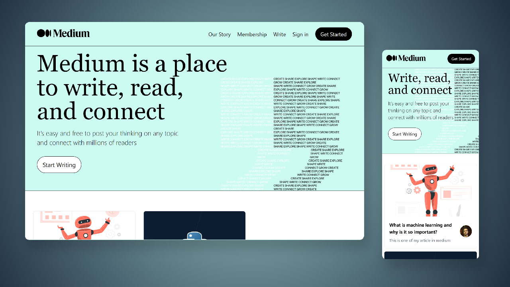

# Medium.com (Redesign with Next.js & Tailwindcss)

It is a redesign of the popular blogging website [Medium.com](https://medium.com). It is designed with React and Tailwindcss in [Nextjs](https://nextjs.org/) framework, and use and config [Sanity](https://www.sanity.io/) as CMS. It is hosted on [vercel](https://medium-clone-blond.vercel.app/).

## Features
* Nextjs
* Sanity
* React 17
* Typescript
* Tailwindcss

## Usage
This repo required [Node](https://nodejs.org/en/) stable version     before setup
1. Clone this Repo
2. cd `e`
3. Create a .env by copying .env.example and Update the required fields.
4. Run `npm install`
5. Run `npm run dev`
6. cd `sanity` 
7. Run `npm install`
8. Run `Sanity Start`

## Contributing

Please see [CONTRIBUTING](.github/CONTRIBUTING.md) for details.

## Security Vulnerabilities

Please review [our security policy](../../security/policy) on how to report security vulnerabilities.

## Credits

-   [k90mirzaei](https://github.com/k90mirzaei)
-   [All Contributors](../../contributors)

## License

The MIT License (MIT). Please see [License File](LICENSE.md) for more information.

## Support

This project needs a ⭐️ from you. Don't forget to leave a star ⭐️
